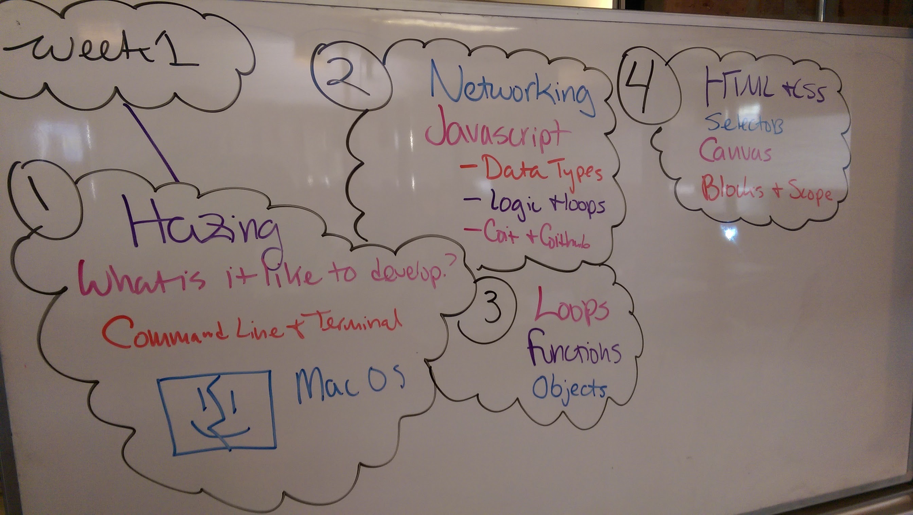

## 1.5 Second Pass Friday



#### WAT

* https://www.youtube.com/watch?v=FqhZZNUyVFM

#### Homework Submission Recap

1. Navigate to `/your_name` in our class repository. `git add`, `git commit`, `git push origin master` to your fork.
2. Browse to https://github.com/your-username/wdi_chi_dragons
3. Select the **green** pull request icon to create a new pull request.
4. Fill out the comments with your level of comfort, completeness, and any comments.
5. Submit!
6. We'll provide feedback to you via Github so check your email!

#### Git & Github


#### Javascript 101 Recap

* Video: https://www.youtube.com/watch?v=24dV8xpEljU

###### Carousel Example

```javascript
var circus = ['johny','jenny','james','jennifer','jack','jim'];

console.log(circus);


for (var cycles = 0; circus.length > 0; cycles++) {

    console.log(cycles);
    if (cycles % 2 == 1) {
        console.log('odd');
        var popped = circus.pop();
        console.log(popped + ' is off the carousel');
    } else {
        console.log('even');
    }

}
console.log(circus);
```


#### Canvas

```html
<html>
<body>

  <canvas id="myCanvas" width="400" height="400"></canvas>

  <script type="text/javascript">
    var canvas = document.getElementById('myCanvas');
    var ctx = canvas.getContext('2d');

    ctx.fillStyle = "rgb(100, 200, 160)";
	ctx.fillRect (0, 350, 100, 50);
	</script>
<body>
</html>
```

###### Draw a square in each corner

Change the javascript in the boiler plate so there is a 50x50 square in each corner of the canvas.

```javascript
ctx.fillStyle = "red";
ctx.fillRect (0, 0, 50, 50);

ctx.fillStyle = "blue";
ctx.fillRect (350, 0, 50, 50);

ctx.fillStyle = "red";
ctx.fillRect (350, 350, 50, 50);

ctx.fillStyle = "blue";
ctx.fillRect (0, 350, 50, 50);
```
