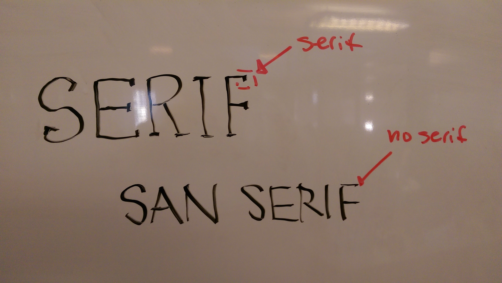

## 2.2 From Wireframe to Production

*The theme of today's class will be learning how to compose a website from scratch. We'll discuss a variety of standards to help build a layout. We'll then explore how to build wireframes, what to look out for, and consider a few examples from live websites. Finally, we'll build our own wireframe and by the evening we'll build out a basic layout.*

#### Sass

###### Learning Objectives

* Understand what a CSS pre-processor is
* Understand a strong use case for a CSS pre-processor
* Use Sass to include variables in your CSS
* Watch for changes in your Sass files and compile them to CSS

#### Web Typography

###### Learning Objectives
- know the differences between webfonts & desktop fonts
- find good webfonts to use in their projects
- incorporate webfonts into their own designs
- Understand how to Build a style guide

#### Advanced CSS

###### Learning Objectives
- Use `classes` in CSS
- Understand how to position elements
- Utilize pseudo-classes in CSS to create a hover effect
- Leverage `:before` and `:after`

#### Wireframes and Mockups

###### Learning Objectives
- Understand the need for wireframes, mockups and MVPs
- Create your own wireframe for a two-column layout
- Polish a mockup after wireframe is completed
- Describe which wireframe elements will be DOM elements

#### Lab/Homework: Create Website from Wireframe

- Create a new Github repository
- Take your wireframe concept and turn it into HTML & CSS
- Store all changes in this Github repository
- Take a screenshot and include it in your `Readme.md`. The code for this is ``
- Post on Slack with a link to your repository by midnight.
