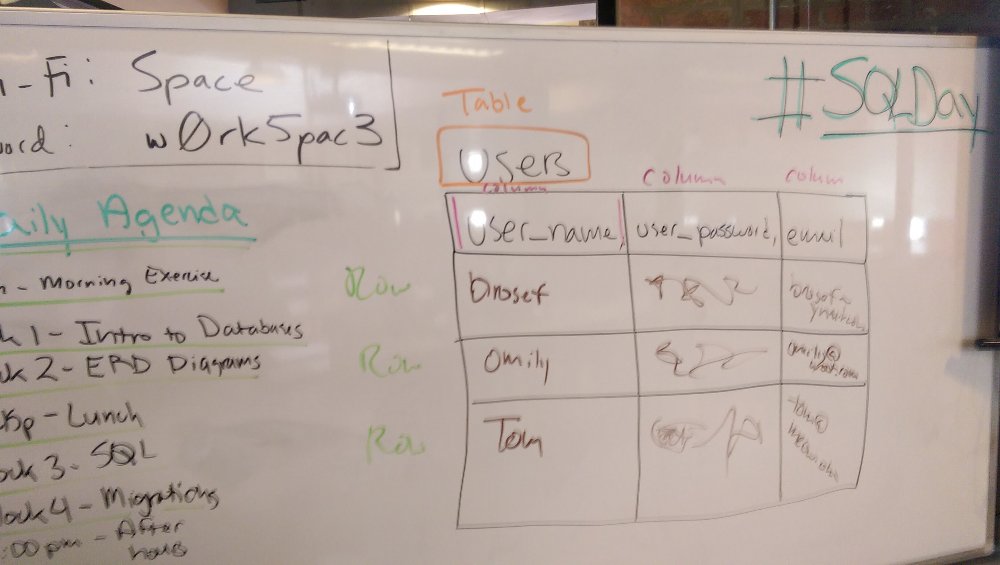

## 5.1 Behind the Models: Databases & SQL

#### Introduction to Databases

**Objectives**

* Understand why we use databases?
* Understand what Tables, Rows, & Columns represent.
* Know what **primary keys** and **foreign keys** are.
* Know the difference between database relationship types.
* Practice drawing Entity Relationship Diagrams (ERD).

**Resources**

* <a href='https://presentations.generalassemb.ly/48968f4167d746ba7c7c#/'>Slide Deck</a> | <a href='https://gist.github.com/code-for-coffee/48968f4167d746ba7c7c'>Markdown Version</a>

#### SQL and Migrations

**Objectives**

* Create databases.
* Connect to databases.
* Create tables.
* Add / query / delete rows from tables.

**Resources**

* <a href='http://postgresapp.com/'>Postgres.app</a>
* <a href='https://presentations.generalassemb.ly/fafcb38d806dee2038d6#/'>Slide Deck</a> | <a href='https://gist.github.com/code-for-coffee/fafcb38d806dee2038d6'>Markdown Version</a>
