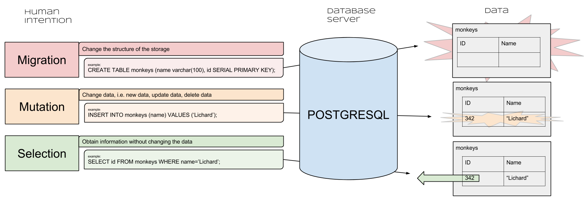

## 5.3 Models & Active Record

*Welcome back! Hopefully you're stuffed full of delicious food from Thanksgiving! Leftover turkey sandwiches, anyone? Today we're going to connect SQL databases to Ruby. To do this, we'll create Models and utilize a tool called ActiveRecord.*

#### From Database to Model

*Let's warm up by creating a database and then accessing it via Ruby!*

**Objectives**:
* Understand how to create a Model
* Create a database for your Model
* Create a table for your Model
* Add some content to your table
* Understand the concept of an ORM
* Install ActiveRecord
* Connect to a database using ActiveRecord

#### Create, Read, Update, & Destroy Data

*Now that we can use ActiveRecord, it is time to manipulate some data...*

**Objectives**:
* Instantiate and create a new instance of a Model using ActiveRecord
* Query a model to read it using ActiveRecord
* Edit a model's attributes ActiveRecord
* Destroy a model using  ActiveRecord
