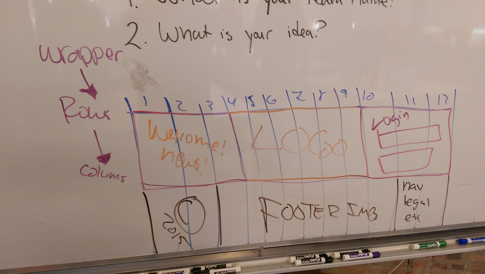

## Bootstrap 101 Self-Practice

- [Get Bootstrap](http://getbootstrap.com/)
- [Grid Example Template](http://getbootstrap.com/examples/grid/)

#### Grid/Columns




#### Individual Practice: Diagram

If you would like to visualize how Bootstrap works, you may do so.

* On Graph paper, create a 12 x 6 grid with a landscape orientation
* Place `header`, `nav`, `article`, `aside`, `footer` tags and more
* Understand the class naming system of Bootstrap for columns
* `col-md-x` where `x` is a value of `1` through `12` for the grid.
* 12 grids are placed inside of a row that live inside of `container`s or `wrapper`s.


#### Boilerplate

```html
<section class='section'>
  <article class='row'>
    <div class='col-md-3'>3</div>
    <div class='col-md-6'>6</div>
    <div class='col-md-3'>3</div>
  </article>
</section>
```

#### Columns should add up to 12!
