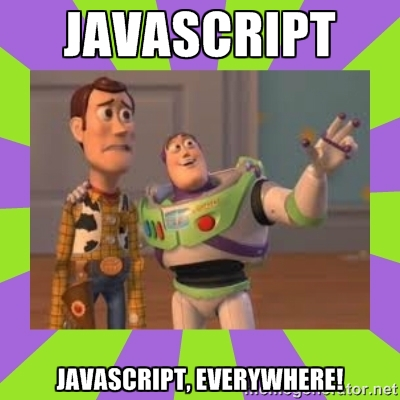

# The MEAN Stack

## What is the MEAN Stack?

The *MEAN* stack is a full stack for development similar to Ruby on Rails or Sinatra (+ whatever database you use). It is built upon cutting-edge, wild-wild west crafted software:
- Angular.js (https://angularjs.org/)
- Express.js (http://http://expressjs.com/)
- Node.js (https://nodejs.org/)
- MongoDB (https://mongodb.org)

### **Let's compare Ruby on Rails with MEAN**

- In *Ruby on Rails* we have been using **Postgres** as our database. We write most of our code in **Ruby**. We rely on **Rails** as our framework to host our application and serve APIS/Views. We use **ERB** and various **Javascript frameworks** like *Backbone* to display our views.

- In the *MEAN* stack, we will be using **MongoDB** as our database. We write most of our code in **Javascript**. We rely on **Node** and **Express.js** to host our application and serve APIs/Views. We use **AngularJS** to render our views that are served by **Express**.

- **Fun Fact**: *Express.js* looks and feels like *Sinatra*. If you liked Sinatra, you'll probably love Express.js because the syntax is very similar.

## How the stack works together

