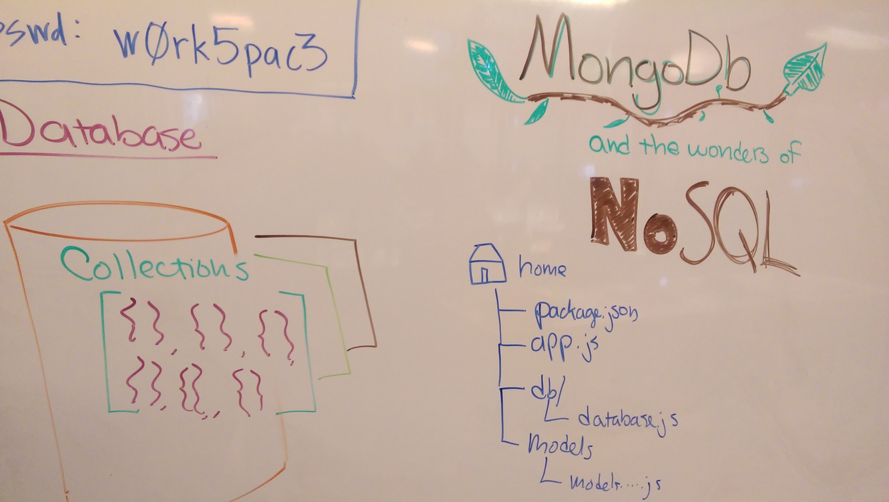

## MongoDB and the Wonders of NoSQL

#### Introduction to MongoDB

**Objectives**:
- Understand what NoSQL is and what is accomplishes
- Compare NoSQL to traditional SQL and understand each other's pros/cons
- Install MongoDB on your system
- Import JSON as a MongoDB into a database as collection
- Use the Mongo console to interact with data

#### Mongo + Node

**Objectives**:
- Use Mongod to run a MongoDB server
- Use the Mongoose ORM to connect to MongoDB
- Define Models as Schemas in MongoDB
- Connect your Models to a Node application

#### Mongo CRUD

**Objectives**:
- Use a Model to create an entry in a collection
- Use a Model to query a collection
- Use a Model to update an entry in a collection
- Use a Model to destroy an entry in a collection

#### Code Examples

* https://github.com/ga-chicago/playing_with_mongo
* https://github.com/ga-chicago/my_first_node_api
