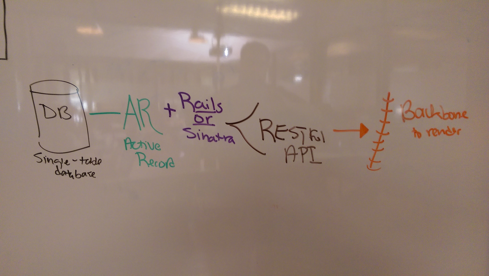

## Backbone.js

Today we're building a Pancake API!

* Source Code: https://github.com/ga-chicago/mongo_pancake_rest_api

#### Awesome Sources

* Addy Osmani's [Developing Backbone.js](http://addyosmani.com/backbone-fundamentals/) *Free book*
* [Namespacing](http://addyosmani.com/blog/essential-js-namespacing/)
* [Backbone.js for Absolute Beginners](http://adrianmejia.com/blog/2012/09/11/backbone-dot-js-for-absolute-beginners-getting-started/)
* [Backbone Tutorials](https://cdnjs.com/libraries/backbone.js/tutorials/)
