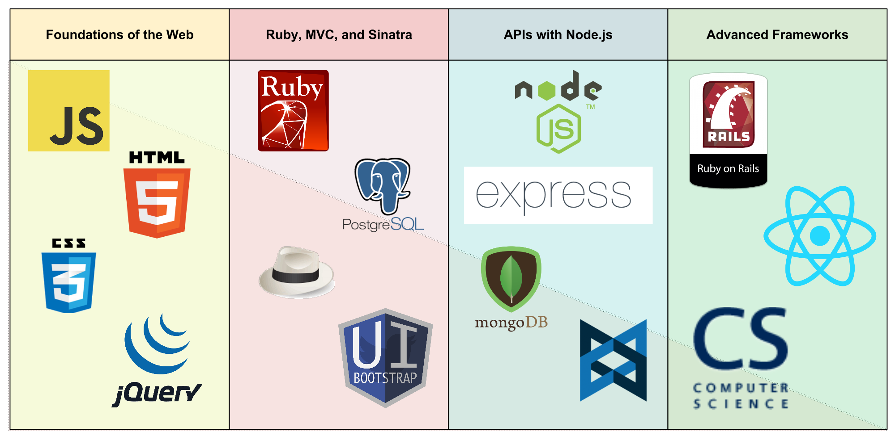

## Course Outline

* **Section 1: Foundations of the Web**
  - HTML
  - CSS
  - Javascript
* **Section 2: Ruby, MVC, and Sinatra**
  - Ruby
  - MVC
  - Sinatra
  - SQL
  - Servers
* **Section 3: APIs with Node.js**
  - Node.js
  - Express.js
  - MongoDB
  - Backbone.js
* **Section 4: Advanced Frameworks**
  - Ruby on Rails
  - React.js

## Weekly Schedule Breakdown

Our weekly schedule is available for viewing here. It is broken down to display what day-to-day looks like in WDI.

